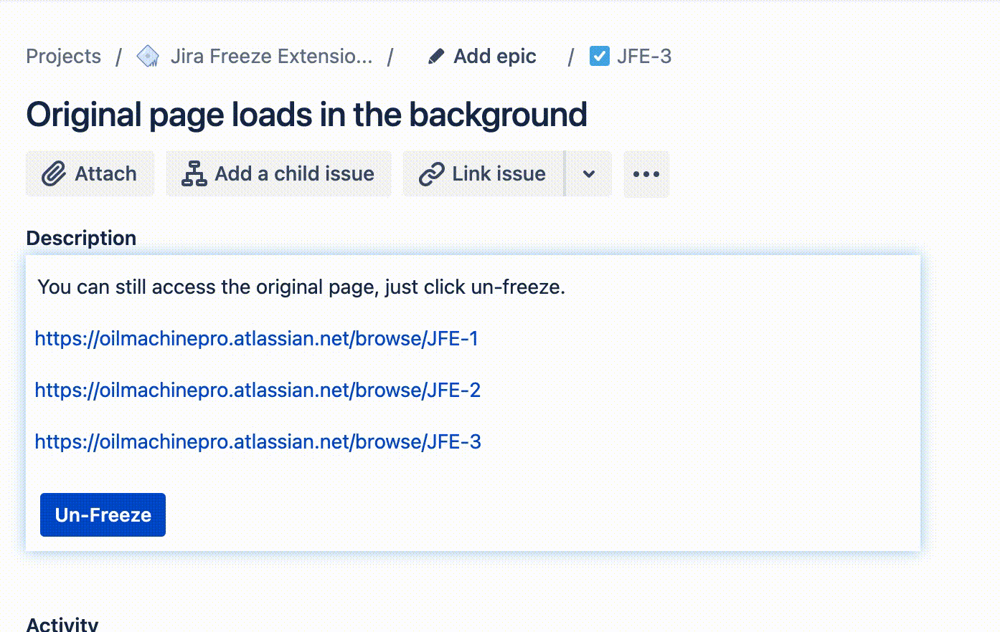

Jira Freeze Extension for chromium browsers works on Jira tickets by freezing the description box as soon as all the content is loaded, preventing Jira from injecting a bunch of unwanted anti-patterns.

- Disable SmartLinks - see useful developer information in all URLs at a glance
- Restore double click to highlight word-wise and triple click to highlight paragraph-wise
- Load time feels much faster because the page is usable sooner
- Original description view loads in the background and is still accessible if you want to edit

### SmartLinks are disabled

### Restore native browser functionality without triggering the description editor

### Unfreeze the page to edit it again

